# Milestone 9 implementation plan — Hermes 0.20 webhooks

Status: In progress through reviewed slice 9D
Prepared: 2026-08-03
Scope: Signed local Hermes lifecycle events, bounded refresh wakeups, health
evidence, and a separate redirect-capability decision

## Executive decision

Build the first Hermes webhook integration as a small, loopback-only event
receiver that can **wake** Mentat's existing read paths. Do not make webhook
payloads a second source of truth.

The first release should accept only four lifecycle events:

- `on_session_start`
- `on_session_end`
- `subagent_start`
- `subagent_stop`

Each accepted event must pass raw-body HMAC verification, header/body matching,
timestamp freshness, replay deduplication, an event allowlist, a body-size cap,
and per-binding rate limiting. It may then enqueue a bounded, coalesced refresh.
The refresh must read Hermes through the existing supported adapters before
Mentat changes any projected state.

The core rule is:

> Webhooks wake. Reconciliation proves.

This gets the responsiveness benefit of Hermes 0.20 without weakening Mentat's
local-first or capability-scoped architecture.

## What Hermes 0.20 gives Mentat

Hermes 0.20 adds signed outbound webhooks to its plugin-hook event system. A
configured target receives an HTTP POST containing the hook event name, session
metadata, an opaque delivery ID, and a timestamp. When `secret_env` is
configured, Hermes signs the exact request body using HMAC-SHA256 and sends the
signature in `X-Hermes-Signature-256`.

Useful properties:

- lifecycle events are available from both CLI and Gateway paths;
- `X-Hermes-Event` identifies the event;
- `X-Hermes-Delivery` matches the signed body's `delivery_id`;
- `X-Hermes-Signature-256` is `sha256=<hex>` over the raw body;
- delivery is asynchronous and does not block the Hermes agent loop;
- connection errors and 5xx responses are retried once;
- 4xx responses are not retried;
- redirects are never followed;
- Hermes uses a bounded queue and may drop events;
- webhook responses cannot steer Hermes and their bodies are ignored;
- `HERMES_SAFE_MODE=1` skips webhook registration.

These semantics make webhooks ideal for awareness and wakeups, but unsuitable
as proof that an operation completed. Mentat must expect duplicates, gaps,
delays, and out-of-order events.

Official contract references:

- [Hermes Agent 0.20 release](https://github.com/NousResearch/hermes-agent/releases/tag/v2026.8.3)
- [Outbound webhook documentation](https://github.com/NousResearch/hermes-agent/blob/main/website/docs/user-guide/features/hooks.md#outbound-webhooks)
- [Outbound webhook implementation](https://github.com/NousResearch/hermes-agent/pull/69406)
- [Active-turn redirect implementation](https://github.com/NousResearch/hermes-agent/pull/63104)

## Scope boundaries

### In the first shippable slice

- one versioned POST endpoint on Mentat's existing loopback server;
- configuration-bound receiver identities;
- signed delivery verification and replay protection;
- four allowlisted lifecycle event types;
- bounded in-process refresh coordination;
- read-only refreshes of sessions, observed agents, attention, and relevant
  Kanban projections;
- durable, secret-free delivery and health evidence;
- a small diagnostics surface;
- Hermes 0.19 and unconfigured-Hermes fallback behavior;
- a real Hermes 0.20 end-to-end test.

### Explicitly deferred

- remote Hermes calling a local Mentat instance;
- a public listener, tunnel, relay, or non-loopback bind;
- unsigned webhook targets;
- `pre_tool_call`, `post_tool_call`, `pre_llm_call`, or `post_llm_call`;
- storage or display of `tool_input`, `cwd`, prompts, responses, or raw event
  bodies;
- direct writes to `~/.hermes/config.yaml` or `~/.hermes/.env`;
- treating a webhook as confirmation of a task mutation;
- replacing periodic reconciliation;
- redirecting an active turn through the webhook endpoint;
- A2A, voice, artifacts, or grounded citations as part of this receiver.

## Proposed system structure

```mermaid
flowchart LR
    H["Hermes 0.20\nCLI or Gateway"]
    E["POST /api/integrations/hermes/webhooks/v1/{binding_id}"]
    V["Request gate\nsize • content type • HMAC • freshness"]
    D["Replay gate\nheader/body match • keyed delivery digest"]
    N["Normalizer\nfour event allowlist • bounded safe fields"]
    Q["Refresh coordinator\nbounded queue • coalescing • backpressure"]
    A["Existing read adapters\nsessions • agents • Kanban"]
    P["Mentat projections\nhealth • presence • attention"]
    R["Periodic reconciliation"]

    H -->|"signed raw JSON"| E --> V --> D --> N --> Q --> A --> P
    R --> A
    P -. "last verified / last reconciled evidence" .-> R
```



### Request path

1. Hermes POSTs to a binding-specific loopback URL.
2. The HTTP handler checks the declared content length before reading.
3. The handler reads at most 64 KiB of raw bytes.
4. The verifier resolves the binding from local configuration, never from the
   body.
5. The verifier computes HMAC-SHA256 over the raw bytes and compares it in
   constant time with `X-Hermes-Signature-256`.
6. Only after signature verification does Mentat parse JSON.
7. The normalizer verifies event and delivery headers against the signed body,
   checks timestamp freshness, and accepts only the four lifecycle events.
8. A keyed digest of the binding ID and delivery ID is inserted into the
   existing owner-only Mentat SQLite database. A uniqueness constraint makes
   Hermes' retry idempotent.
9. The event becomes a minimal in-memory refresh hint. The raw body is released
   and is never written to disk.
10. The coordinator coalesces hints and calls existing read adapters. Only the
    adapter results may update projections.

## HTTP contract

### Endpoint

```text
POST /api/integrations/hermes/webhooks/v1/{binding_id}
```

`binding_id` is a locally configured opaque identifier. It maps to a Mentat
connection/profile selection and an environment-variable reference for the
shared HMAC secret. It is not a profile name, session ID, or secret.

### Required request properties

| Property | Rule |
| --- | --- |
| Transport | Existing loopback-only Mentat HTTP server |
| Method | `POST` only |
| Content type | Exactly `application/json` |
| Maximum body | 64 KiB |
| Signature | Required `sha256=` plus 64 lowercase hexadecimal characters |
| Signature input | Exact raw request bytes, before JSON parsing |
| Event header | `X-Hermes-Event`, exact match to `hook_event_name` |
| Delivery header | `X-Hermes-Delivery`, exact match to `delivery_id` |
| Timestamp | RFC 3339 UTC, no more than 5 minutes in the past or future |
| Event | One of the four Phase 1 lifecycle events |
| Binding | Must exist and be enabled in local Mentat configuration |

Unknown top-level JSON fields may be ignored for forward compatibility, but
Mentat extracts only the allowlisted fields and applies strict type/length
bounds to them. Unknown event names fail closed.

### Response behavior

| Result | Status | Hermes behavior |
| --- | ---: | --- |
| First valid delivery accepted | `202` | Success; refresh may happen asynchronously |
| Valid duplicate delivery | `204` | Success; no duplicate refresh is required |
| Missing or invalid signature | `401` | No retry |
| Unknown/disabled binding | `404` | No retry; endpoint does not reveal binding state |
| Wrong content type | `415` | No retry |
| Oversized body | `413` | No retry |
| Invalid JSON/schema/header match | `400` | No retry |
| Stale or future timestamp | `422` | No retry |
| Per-binding rate exceeded | `429` | No retry; reconciliation remains the backstop |
| Receiver storage temporarily unavailable | `503` | One Hermes retry may occur |

Responses contain no event payload, delivery ID, session ID, profile name,
secret reference, file path, stack trace, or verifier detail.

## Configuration and identity

The receiver should extend local, untracked Mentat configuration with a small
binding list. The actual secret remains in an environment variable available
to Mentat. Hermes uses the same secret through its `secret_env` setting.

Proposed Mentat configuration:

```toml
[hermes_webhooks]
enabled = true

[[hermes_webhooks.bindings]]
id = "local-default"
connection = "local"
profile = "default"
secret_env = "MENTAT_HERMES_WEBHOOK_SECRET_DEFAULT"
events = [
  "on_session_start",
  "on_session_end",
  "subagent_start",
  "subagent_stop",
]
```

Operator-reviewed Hermes configuration:

```yaml
hooks:
  outbound:
    - name: mentat-local-default
      url: http://127.0.0.1:8888/api/integrations/hermes/webhooks/v1/local-default
      events: [on_session_start, on_session_end, subagent_start, subagent_stop]
      secret_env: MENTAT_HERMES_WEBHOOK_SECRET_DEFAULT
      timeout: 3
```

Mentat must not create or edit that Hermes block. Setup documentation should
explain that changes take effect on the next Hermes CLI session or Gateway
restart.

### Binding rules

- binding IDs match `[A-Za-z0-9_-]{1,48}`;
- binding IDs are unique;
- profiles and connections must match configured Mentat inventory;
- event lists must be non-empty subsets of the Phase 1 allowlist;
- environment-variable references are validated at startup but never returned
  to the browser;
- a missing secret makes the binding **not ready**, never unsigned;
- the browser receives a safe label and state only: `off`, `ready`,
  `receiving`, or `degraded`;
- profile identity comes from the binding, not `session_id`, `cwd`, `extra`, or
  any other webhook-supplied field.

## Proposed code layout

```text
hermes_webhooks.py
    constants and bounded schemas
    WebhookBinding
    VerifiedHermesEvent
    verify_and_normalize(raw_body, headers, binding, now)
    record_delivery(connection, event)
    secret-free error codes and health snapshot

hermes_event_refresh.py
    RefreshHint
    HermesRefreshCoordinator
    bounded queue and per-binding coalescing
    adapter refresh dispatch
    startup/shutdown/reconciliation lifecycle

runtime_config.py
    parse and validate [hermes_webhooks]
    resolve secret environment values server-side only

mentat_db.py
    schema migration for delivery dedupe and receiver health

server.py
    raw webhook route before ordinary JSON mutation parsing
    receiver health GET route
    coordinator startup and shutdown wiring

public/core.js
public/app.js
public/index.html
public/styles.css
    read-only Webhook Health card and refresh indicator

tests/test_hermes_webhooks.py
tests/test_hermes_webhook_routes.py
tests/test_hermes_event_refresh.py
tests/test_hermes_webhook_browser_contract.py
scripts/hermes_webhook_probe.py
    deterministic local signed-payload probe for operator verification
```

The webhook route must be handled before `server.py`'s ordinary mutation JSON
parser because HMAC verification depends on the exact raw bytes. The route
handler should remain thin: bound the body, pass raw bytes and selected headers
to `hermes_webhooks.py`, enqueue the normalized hint, and return.

## Private data model

Use the existing owner-only Mentat SQLite boundary. Do not add webhook records
to tracked JSON fixtures.

### `hermes_webhook_deliveries`

| Column | Purpose |
| --- | --- |
| `binding_id` | Local configured binding identifier |
| `delivery_digest` | HMAC/keyed digest of binding ID + delivery ID; never raw ID |
| `event_name` | One of the four allowlisted event names |
| `received_at` | Local receipt time |
| `expires_at` | Dedupe retention boundary |
| `outcome` | `accepted` or `duplicate`; bounded enum |

Primary key: `(binding_id, delivery_digest)`.

Retain dedupe records for 24 hours. Delete expired rows in bounded batches on
startup and periodically. This is longer than the five-minute freshness window
and easily covers Hermes' retry behavior.

### `hermes_webhook_health`

| Column | Purpose |
| --- | --- |
| `binding_id` | Local configured binding identifier |
| `last_verified_at` | Last valid signed delivery |
| `last_event_name` | Safe allowlisted event name |
| `last_refresh_started_at` | Last adapter refresh start |
| `last_refresh_completed_at` | Last successful adapter refresh |
| `last_reconciled_at` | Last scheduled reconciliation |
| `accepted_count` | Monotonic local count |
| `duplicate_count` | Monotonic local count |
| `rejected_count` | Monotonic local count without payload details |
| `queue_drop_count` | Local backpressure evidence |
| `last_error_code` | Bounded secret-free code |

Do not persist raw headers, signatures, bodies, delivery IDs, session IDs,
paths, tool inputs, `extra`, model names, prompts, responses, or stack traces.

## Normalized event contract

```python
@dataclass(frozen=True)
class VerifiedHermesEvent:
    binding_id: str
    event_name: Literal[
        "on_session_start",
        "on_session_end",
        "subagent_start",
        "subagent_stop",
    ]
    delivery_digest: str
    occurred_at: datetime
    received_at: datetime
    completed: bool | None
    interrupted: bool | None
    platform: str | None
```

`platform` is optional, normalized to a small allowlist or `other`, and is not
required to schedule a refresh. All other body fields are ignored after
verification.

## Event-to-refresh matrix

| Verified event | Immediate safe effect | Authoritative read-back |
| --- | --- | --- |
| `on_session_start` | Mark session/agent projections stale; show recent activity pulse | Refresh recent sessions and observed agent presence |
| `on_session_end` | Mark session/attention projections stale | Refresh recent sessions, active run state, and attention |
| `subagent_start` | Mark agent-presence projection stale | Refresh observed agents/subagent status when supported |
| `subagent_stop` | Mark agent and relevant task projections stale | Refresh agents and linked Kanban/task observations |

No row directly completes a Mentat task, closes attention, changes Kanban,
changes a provider, starts a run, or sends a prompt.

## Refresh coordinator

Recommended defaults:

- queue capacity: 256 hints;
- coalescing window: 250 ms;
- one pending refresh per `(binding_id, projection_kind)`;
- one worker thread owned by the Mentat server lifecycle;
- maximum one concurrent Hermes read per binding;
- periodic reconciliation: existing cadence when active, plus a 60-second
  inactive safety sweep for webhook-enabled local bindings;
- exponential local backoff after adapter errors, capped at 30 seconds;
- queue overflow increments health evidence and relies on reconciliation;
- server shutdown stops accepting events, drains for at most two seconds, then
  exits without blocking indefinitely.

Coalescing is important because a single Hermes turn can emit several lifecycle
signals, and Hermes Gateway may host multiple concurrent sessions. A storm
should produce one useful refresh, not one Hermes read per POST.

## Browser and operator experience

Add a small read-only Webhook Health area to the existing Hermes/Console
diagnostics surface.

Show:

- Off — receiver or binding disabled;
- Ready — secret resolved and endpoint available, no recent delivery;
- Receiving — a signed event was verified recently;
- Degraded — queue drops, refresh failure, stale reconciliation, or binding
  configuration problem;
- last verified event age;
- last successful refresh age;
- last reconciliation age;
- safe counters for accepted, duplicate, rejected, and locally dropped events;
- the four configured event names;
- a copyable endpoint URL and non-secret setup instructions.

Never show:

- the secret or signature;
- the secret environment-variable name;
- delivery IDs or their digests;
- Hermes session IDs;
- local paths or `cwd`;
- raw event bodies;
- tool inputs, prompts, or responses;
- model metadata from the webhook body.

The initial browser can continue its existing polling. A separate Mentat
server-to-browser event stream may later wake UI refreshes, but it is not
required to prove the webhook receiver. Hermes-to-Mentat webhooks alone do not
remove the current browser polling loop.

## Logging and diagnostics

Use fixed error codes and bounded counters:

```text
webhook_binding_unavailable
webhook_content_type_invalid
webhook_body_oversized
webhook_signature_missing
webhook_signature_invalid
webhook_json_invalid
webhook_delivery_mismatch
webhook_event_mismatch
webhook_event_unsupported
webhook_timestamp_invalid
webhook_timestamp_stale
webhook_delivery_duplicate
webhook_rate_limited
webhook_store_unavailable
webhook_queue_full
webhook_refresh_failed
```

Logs may include the safe error code, allowlisted event name after successful
verification, safe binding label, and timing/counter data. They must not include
request bodies, request headers, signatures, secrets, delivery IDs, session
IDs, paths, or exception text that may contain those values.

## Implementation slices

### 9A — Contract fixtures and capability discovery

Deliverables:

- freeze sanitized fixtures for all four Hermes 0.20 events;
- add a version/capability result that distinguishes 0.19, compatible 0.20,
  partial 0.20, and unconfigured receiver state;
- add validated webhook binding configuration;
- document the manual Hermes target configuration;
- add a deterministic signed probe script that never logs its secret;
- decide whether the local Hermes binary exposes `hermes hooks list` in a
  stable machine-readable form. If not, treat configuration as operator
  attestation plus live delivery evidence rather than scraping terminal text.

Exit gate:

- pure contract tests pass without starting a server;
- no new write to a Hermes-owned file exists;
- Hermes 0.19 reports the current safe behavior with no noisy receiver errors.

Estimated effort: 1–2 focused engineering days.

### 9B — Signed receiver and durable replay protection

Deliverables:

- add `hermes_webhooks.py`;
- add the raw-body route to `server.py`;
- add strict request bounds and constant-time HMAC verification;
- add the private SQLite migration and 24-hour dedupe cleanup;
- add per-binding token-bucket rate limiting;
- return the response codes in the HTTP contract;
- add secret-free counters and errors.

Exit gate:

- malformed, unsigned, stale, replayed, oversized, unknown, and header/body
  mismatched deliveries never reach the refresh coordinator;
- valid Hermes retries are idempotent;
- concurrent duplicate requests accept at most one first delivery.

Estimated effort: 2–3 focused engineering days.

### 9C — Refresh coordinator and projections

Deliverables:

- add `hermes_event_refresh.py`;
- add queue bounds, coalescing, adapter concurrency limits, and shutdown rules;
- connect each event to the matrix above;
- preserve periodic reconciliation;
- verify that a dropped queue hint converges on the next reconciliation;
- add tests for storms, out-of-order events, adapter failures, and restart.

Exit gate:

- a webhook can make Mentat fresher without directly changing authoritative
  task/run state;
- 1,000 rapid valid events keep memory bounded and collapse to a small number
  of adapter reads;
- adapter failure produces degraded health but no false terminal state.

Estimated effort: 2–3 focused engineering days.

### 9D — Health UI and operator setup

Deliverables:

- add a safe receiver-health endpoint;
- add the read-only Webhook Health UI;
- add copyable manual Hermes configuration with no secret values;
- add a local signed-probe verification flow;
- add browser contract tests proving private fields never appear.

Exit gate:

- an operator can tell whether the receiver is off, ready, receiving, or
  degraded;
- diagnostics remain useful without revealing private payload data.

Estimated effort: 1–2 focused engineering days.

#### Approved 9D slice contract — 2026-08-14

Stable slug: `hermes-webhook-health-setup`

The smallest useful 9D outcome is a dedicated, read-only receiver-health
surface plus an operator-controlled signed probe that traverses Mentat's real
loopback HTTP receiver. The browser never receives the shared secret or its
machine-specific reference, and Mentat still does not edit Hermes-owned
configuration.

In scope:

- deterministic `off`, `ready`, `receiving`, and `degraded` states;
- bounded ages for the last verified event, authoritative refresh, and
  reconciliation;
- bounded counters for accepted, coalesced, and dropped hints, refresh success
  and failure, and reconciliation;
- a responsive and accessible Settings panel;
- copyable manual Hermes configuration containing only the local target URL,
  allowlisted events, and a generic private-secret placeholder;
- a fixed server-side probe that reads the secret privately and sends one
  synthetic signed event through the real loopback route;
- browser/API contracts proving private fields never appear; and
- focused, full-suite, computer-use, dual-reviewer, packaging, and Lighthouse
  evidence, with all four Lighthouse categories required to equal 100.

Out of scope:

- remote relays, browser push, polling retirement, new event types, Kanban
  mutation, busy-input redirect behavior, or Mentat-written Hermes setup;
- secret values, environment-variable names, signatures, delivery/session
  identifiers, payload bodies, local paths, profile identifiers, and exception
  text in browser responses.

Acceptance criteria:

1. Health reports the four states deterministically and fails closed.
2. Ages and counters are bounded, payload-free, and binding-safe.
3. The probe traverses the signed receiver without exposing its secret.
4. An unconfigured receiver rejects probing safely and remains quiet.
5. Settings explains setup, displays health, copies a sanitized template, and
   verifies a probe at desktop and phone widths.
6. Browser and API tests prove prohibited private fields never appear.
7. Hermes 0.19 and unconfigured behavior remain unchanged.
8. Focused tests, the complete suite, computer-use checks, two independent
   adversarial reviews, package verification, and Lighthouse 100/100/100/100
   pass.

The accepted implementation strategy uses a dedicated health endpoint and a
fixed server-side loopback probe. A CLI-only probe was rejected because it
would not prove the browser-to-Mentat operator workflow. Folding receiver state
into generic subsystem health was also rejected because it would blur the
receiver-specific state and setup contract.

Version-control strategy: branch `codex/hermes-webhook-health-setup`, stacked
on `codex/hermes-webhook-refresh-coordinator`; persistent evidence lives in
`reviews/2026-08-14-hermes-webhook-health-setup.md`.

### 9E — Busy-input steer capability

Status: **Implementation in progress 2026-08-14.** Current upstream Hermes
advertises `run_steer` with the fixed authenticated
`POST /v1/runs/{run_id}/steer` operation. Hermes defines this as guidance that
arrives after a tool boundary, not a replacement of the active model turn.
Mentat therefore labels the action **Steer**, never redirect or correction.

Deliverables:

- inspect the local CLI, Gateway/API, and remote Runs transport for a fixed
  redirect/steer operation;
- require capability advertisement, stable run/session identity, text-only
  input bounds, and post-action read-back;
- expose an explicit text-only **Steer** composer mode and `/steer <guidance>`
  command while that exact remote capability is active;
- keep **Stop** separate and keep ordinary Send, attachments, new-session, and
  provider/profile changes locked while a run is active;
- keep the composer lock when the selected transport cannot verify steer.

Transport decision matrix:

| Mentat transport | Native operation | Mentat decision |
| --- | --- | --- |
| Local one-shot `hermes chat -q` | Process-local interactive steer exists, but the spawned one-shot run exposes no fixed external control channel | Unavailable; keep the busy composer locked |
| Remote Hermes Runs API with exact `run_steer` advertisement | `POST /v1/runs/{run_id}/steer`, exact acceptance response, `run.steered`, and pollable run status | Available as text-only Steer with pre-check, acceptance validation, and post-action read-back |
| Remote Runs API without the exact feature and endpoint | None trusted | Unavailable; fail closed without a button or command dispatch |
| Hermes TUI/Desktop gateway | `session.redirect` and interactive commands exist, but Mentat is not connected to that transport | Out of scope; do not infer support for the current Mentat transport |

The current Runs steer schema does not advertise media or attachment input.
Mentat keeps the attachment picker disabled during an active run. A future
steer-attachment path requires an upstream versioned capability with exact
media bounds and post-action verification; Mentat must not flatten files into
text and call that native attachment steering.

Hermes-style slash-command parity is a follow-up product surface. Commands may
be added only through Mentat's fixed versioned command manifest and fixed
handlers; CLI help scraping and arbitrary passthrough remain prohibited.

Exit gate:

- Mentat exposes no steer claim without a supported operation and verified
  post-action state;
- the decision and transport matrix are documented;
- text entered during a compatible active run reaches only the guarded steer
  operation, while incompatible transports remain locked.

Estimated effort: 1–2 focused engineering days.

### 9F — Live Hermes 0.20 validation and rollout

Deliverables:

- configure one local test profile manually;
- run real CLI and Gateway lifecycle events where available;
- test `HERMES_SAFE_MODE=1` behavior;
- test process restart, clock skew, duplicated retry, dropped events, event
  storm, out-of-order end/start, and disabled binding;
- run the focused tests, full suite, browser smoke, and two adversarial reviews;
- capture a redacted verification log;
- update the maintained Hermes baseline only after evidence passes.

Exit gate:

- live Hermes 0.20 signatures verify from exact raw bodies;
- Mentat converges after intentionally dropped events;
- no payload-private value reaches tracked files, logs, health APIs, or UI;
- rollback is proven by disabling the binding and removing the Hermes target.

Estimated effort: 1–2 focused engineering days plus review time.

### 9G — Remaining Hermes 0.20 product decisions

Record bounded, separate decisions for A2A v1.0, grounded citations, desktop
artifacts, and voice. None is implied by the receiver and none becomes a new
Mentat authority without its own approved contract.

### Recommended implementation total

The receiver work is approximately 7–12 focused engineering days, plus 1–2
days for the separate redirect capability spike,
depending on how much existing session/Kanban refresh code can be reused
without refactoring. Implement it as reviewable slices rather than one large
patch.

## Test matrix

### Pure verifier tests

- valid signature;
- one-byte body change after signing;
- missing signature;
- wrong algorithm prefix;
- invalid hex and wrong signature length;
- content-type mismatch;
- exact 64 KiB boundary and one byte over;
- invalid UTF-8 and invalid JSON;
- missing required keys;
- header/body event mismatch;
- header/body delivery mismatch;
- timestamp at both freshness boundaries;
- stale past and future timestamps;
- each allowed event;
- unknown event;
- extra unknown top-level fields ignored without persistence;
- `tool_input`, `cwd`, and `extra` never appear in the normalized record.

### Storage and concurrency tests

- first delivery wins;
- retry is duplicate;
- two simultaneous identical deliveries produce one accepted row;
- digest differs by binding even for the same delivery ID;
- raw delivery ID cannot be found in the database;
- 24-hour cleanup is bounded;
- database unavailable returns 503 and does not enqueue;
- owner-only database/storage invariants remain intact.

### Coordinator tests

- one event schedules the correct projections;
- four related events coalesce;
- unrelated bindings remain isolated;
- queue capacity cannot grow;
- queue overflow increments the safe counter;
- adapter exceptions back off and degrade health;
- shutdown is bounded;
- reconciliation repairs a deliberately dropped event;
- out-of-order events cannot produce a false completed state.

### Route and privacy tests

- webhook route is POST-only;
- ordinary JSON mutation parser does not pre-read/re-encode the body;
- non-loopback server binding remains impossible;
- response bodies reveal no verifier detail;
- logs reveal no signature, secret, delivery ID, session ID, path, prompt, or
  tool input;
- health API reveals only the safe fields listed above;
- browser renders safe states and never receives secret references.

### Compatibility tests

- Hermes absent;
- Hermes 0.19;
- Hermes 0.20 with no outbound target;
- Hermes 0.20 with unsigned target;
- Hermes 0.20 signed local CLI target;
- Hermes 0.20 signed local Gateway target;
- Hermes safe mode;
- Windows and POSIX loopback behavior.

## Rollout and rollback

1. Ship receiver code behind `hermes_webhooks.enabled = false` by default.
2. Enable one local profile and run the signed probe.
3. Observe a full day of real lifecycle traffic with reconciliation enabled.
4. Enable additional local profiles one binding at a time.
5. Keep tool/LLM events disabled until a separately reviewed privacy case
   exists.
6. Promote Hermes 0.20 to the maintained baseline only after the live gate and
   adversarial reviews pass.

Rollback requires no data migration reversal: disable the Mentat binding,
remove the operator-managed Hermes outbound target, restart Hermes, and leave
the dedupe/health rows to expire. Mentat continues through its existing polling
and reconciliation paths.

## Steer and the current input lock

The webhook receiver does not unlock the Agent Console composer. The current
lock has two independent layers:

- the browser disables composer/send controls while a run is active;
- the server rejects a second prompt for an active run.

Hermes' interactive redirect feature proves that Hermes can redirect an active
turn on some native surfaces. Separately, the current authenticated Runs API
advertises text-only `run_steer`, which injects guidance after a tool boundary.
Mentat implements only the latter semantics for its remote Runs transport.

Run a separate capability spike after 9B begins:

1. inspect the installed local CLI, Gateway/API, and published Runs API for a
   fixed redirect/steer operation;
2. require a stable run/session identifier, text-only input schema, explicit
   capability advertisement, and post-operation read-back;
3. if available, expose **Steer** as a distinct mode bound to the current
   connection, profile, transport, Mentat control revision, and remote run;
4. keep attachments unsupported for correction unless Hermes explicitly
   defines them;
5. preserve **Stop** as a hard stop with different language and confirmation;
6. if no supported redirect operation exists, allow only **Save draft** or an
   explicitly labeled **Queued follow-up** whose eventual delivery is verified;
7. change the visible submit label and accessible name from **Send** to
   **Steer** while this mode is active, so the same textbox remains writable
   without ambiguous ordinary-send behavior.

The decision gate is simple: no capability plus no post-action verification
means no Mentat steer mode.

## Milestone exit checklist

- [ ] Four lifecycle events are contract-tested and live-verified.
- [ ] Receiver is loopback-only and versioned.
- [ ] HMAC uses raw bytes and constant-time comparison.
- [ ] Timestamp, delivery, event, size, type, binding, rate, and replay gates
      fail closed.
- [ ] Raw payloads and private identifiers are never persisted or exposed.
- [ ] Accepted events only enqueue read-only refreshes.
- [ ] Reconciliation repairs missed, delayed, and out-of-order delivery.
- [ ] Hermes 0.19 and unconfigured 0.20 remain quiet and safe.
- [ ] Health UI exposes useful evidence without secrets.
- [ ] Full tests, browser smoke, local Hermes 0.20 E2E, and two adversarial
      reviews pass.
- [ ] Redirect is separately exposed only if the selected transport advertises
      and verifies it.

## Recommendation

Start implementation with 9A and 9B together as the first reviewed slice:
configuration, pure verifier, raw-body route, SQLite dedupe, and tests. Do not
touch UI projections until that security boundary is stable. Then add the
coalescing refresh coordinator, health UI, and live rollout in subsequent
slices.
