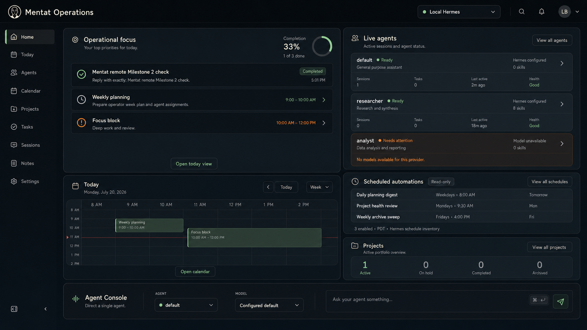

# Mentat Operations design system

Status: Completed design reference

Direction: Emerald Operations

Current implementation: the Python compatibility interface under `public/`

Migration target: the Next.js app under `web/`



The Emerald Operations design is already implemented. The current interface
and `public/styles.css` are the visual source of truth for the Next.js
migration. The concept image and [`figma-variables.json`](./figma-variables.json)
record the completed design decisions and help check token values.

Port the effective Emerald styles into small, source-owned Next.js components.
Do not import the full compatibility stylesheet or carry over its historical
cascade. Its DOM IDs and view keys do not apply to new routes.

## Product feel

Mentat should feel calm and practical. The first screen should show what needs
attention, what is running, and what the operator can do next.

- Use near-black green surfaces, warm ivory text, and restrained emerald.
- Use orange for attention and red for failure or destructive actions.
- Name loading, empty, disconnected, unsupported, waiting, and failed states.
- Keep private paths, credentials, and runtime-only IDs out of the interface.
- Use local fonts, icons, and images. The interface must not depend on a CDN.

## Routes

The first application routes are:

| Route | Purpose |
| --- | --- |
| `/` | Home and current operational context |
| `/agents` | Agent identity, status, and management |
| `/tasks` | Planning, assignment, and task details |
| `/runs` | Run status, events, and supported controls |

Calendar, projects, notes, settings, and deeper Console workflows will move in
later slices. Add a navigation item only when its route has a real screen.

The compatibility interface on port 8888 keeps its current six view keys while
the new routes are built.

## Application shell

### Desktop

- 64 px utility bar
- 216 px navigation rail at 1200 px and wider
- flexible content grid
- 18 to 32 px outer padding

### Compact desktop

- 76 px icon rail from 901 to 1199 px
- flexible content grid
- visible tooltips and accessible names for icon controls

### Mobile

- top utility bar and modal navigation drawer at 900 px and below
- one content column
- 16 px padding, reduced to 12 px below 640 px
- 44 px touch targets

The body must not scroll horizontally. A calendar or wide table may scroll
inside its own labeled region.

The shell includes:

- Mentat portrait and product name
- current page
- local connection state
- global search when its route behavior exists
- navigation
- help and settings when those routes exist

Show a disclosure icon only when a control can open a working menu. A static
connection label must look static.

## Color

Components use semantic tokens. They must not use raw palette values directly.

Core values:

| Token | Value | Use |
| --- | --- | --- |
| `surface/canvas` | `#070D11` | Page background |
| `surface/app-bar` | `#05090B` | Utility bar and deepest chrome |
| `surface/panel` | `#0F151A` | Main panels |
| `surface/panel-raised` | `#121A20` | Raised panels and menus |
| `surface/row` | `#10171B` | Rows and inset content |
| `surface/row-hover` | `#182127` | Hovered rows |
| `content/primary` | `#EAE7DD` | Main text |
| `content/secondary` | `#AAB1AF` | Supporting text |
| `content/tertiary` | `#7E898B` | Quiet metadata |
| `border/subtle` | `#202B30` | Quiet dividers |
| `border/default` | `#2A373B` | Controls and panels |
| `status/ready` | `#9DCE9B` | Ready, selected, completed |
| `status/attention` | `#E69148` | Needs attention |
| `status/failed` | `#DB716B` | Failure and destructive actions |
| `status/info` | `#70A9BD` | Neutral information |

The complete primitive and semantic values are in
[`figma-variables.json`](./figma-variables.json). That file is the value source
for Figma and CSS.

### Contrast modes

Support two modes:

- `data-contrast="standard"` for Operations Dark
- `data-contrast="high"` for High Contrast

Store an explicit choice in `mentat-contrast-v1`. If there is no saved choice,
follow `prefers-contrast: more` before CSS loads.

Every rendered combination must meet WCAG 2.2 AA. Measure final browser output,
including opacity, gradients, font weight, and selected states.

### Effects

- Normal panels have no shadow.
- Popovers may use `0 12px 32px rgba(0, 0, 0, 0.32)`.
- Dialogs may use `0 24px 64px rgba(0, 0, 0, 0.48)`.
- Focus uses a solid 2 px semantic ring with a 2 px offset.
- High Contrast mode may replace gradients with flat colors.

## Type

Use Inter Variable only if it is bundled locally with a suitable license.
Otherwise use:

```css
font-family: Inter, ui-sans-serif, system-ui, -apple-system, BlinkMacSystemFont,
  "Segoe UI", sans-serif;
```

Use monospace for commands, IDs, exact runtime values, and diagnostics.

| Style | Size and line height | Weight |
| --- | --- | --- |
| Brand | 20 / 28 | 600 |
| Page title | 24 / 32 | 600 |
| Section title | 18 / 24 | 600 |
| Card title | 15 / 20 | 600 |
| Body | 14 / 20 | 400 |
| Small body | 13 / 18 | 400 |
| Label | 12 / 16 | 500 |
| Metadata | 11 / 16 | 500 |
| Button | 13 / 20 | 500 |

Use sentence case. Keep body text at 14 px or larger. Never truncate a task
title or confirmation target unless the full value remains easy to reach.

## Spacing and size

Use a 4 px base unit.

```text
4, 8, 12, 16, 20, 24, 32, 40, 48, 64
```

Use these radii:

| Token | Value | Use |
| --- | --- | --- |
| `radius/1` | 4 px | Tiny status elements |
| `radius/2` | 6 px | Buttons and fields |
| `radius/3` | 8 px | Rows and compact cards |
| `radius/4` | 10 px | Standard panels |
| `radius/5` | 12 px | Menus and major panels |
| `radius/6` | 16 px | Dialogs |

Desktop controls are at least 36 px tall. Comfortable controls are 40 px.
Touch targets are at least 44 x 44 px.

Sibling actions stay in one compact group at the edge of a header. Wrap the
group on narrow screens before stretching buttons to full width.

## Motion

- Fast feedback: 120 ms
- Menus and selection: 160 ms
- Drawers and dialogs: 220 ms
- Default easing: `cubic-bezier(.2,.8,.2,1)`

Animate opacity, color, and transforms. Avoid height animation in dense lists.
Remove nonessential motion when `prefers-reduced-motion: reduce` is active.

## Identity

Use the project-owned Mentat Operations mark:

[`assets/mentat-operations-mark.png`](./assets/mentat-operations-mark.png)

- Desktop mark: 32 px
- Compact rail mark: 32 px
- Mobile mark: 28 px
- Minimum size: 24 px
- Minimum clear space: 8 px

Keep the original portrait shape. Use warm ivory linework and one restrained
emerald detail. Do not add glow, a badge plate, or a replacement symbol.

Create a clean vector version before final production use. Keep the original
source artwork unchanged.

## Shared components

Build source-owned components only when a route needs them.

### Panel

A panel has one clear outer boundary. Its header puts the title and supporting
text at the start and one compact action group at the end.

Variants:

- standard
- raised
- inset
- attention
- danger

### Buttons

Variants:

- primary
- secondary
- ghost
- attention
- destructive
- icon

Use one primary action per panel or dialog. Loading must keep the button width
stable. Explain important disabled states in nearby text.

### Fields

Every field has a visible label. Placeholder text is not a label. Show
validation below the field with text and a semantic state.

Read-only values use an information row instead of a disabled input.

### Status

Use a dot and a text label. Color alone is never enough.

Common labels:

- Ready
- Running
- Waiting for input
- Needs attention
- Ready for review
- Disconnected
- Failed
- Read-only

### Data states

Every data surface defines:

- loading
- empty
- disconnected
- unsupported
- stale or degraded
- validation or permission failure
- safe retry, when retry is supported

Use a short title, one sentence of help, and one safe action when an action
exists. Do not show sample rows that look like live data.

### Dialogs

Dialogs keep the title and actions reachable while long content scrolls inside
the body. Focus enters the dialog, stays inside it, and returns to the opener.
Escape closes noncommitted dialogs.

Preview text, confirmation targets, partial failures, and verification results
are safety content. Do not hide or shorten them for appearance.

## Page direction

### Home

The full Home concept uses a 12-column desktop grid:

| Region | Columns |
| --- | ---: |
| Operational focus | 7 |
| Agent operations | 5 |
| Today | 7 |
| Scheduled automations | 5 |
| Projects | 5 |
| Agent Console | 12 |

The shell slice may show honest foundation states. Live data arrives in later
vertical slices.

Scheduled automations are read-only. Do not show create, edit, enable, disable,
delete, queue, or run controls. Before live cron data appears on Home, Python
must hide local cron inventory when a remote Hermes runtime is selected.

### Agents

Show Agent identity, status, active work, attention, and review state first.
Keep provider and runtime details secondary. Runtime references and credentials
must not reach the browser.

### Tasks

Keep planning and assignment clear. The full route must support current Task
fields and safety steps, including dependencies, recurrence, reminders, links,
deletion confirmation, and delegation preview.

### Runs

Show run state, normalized events, messages, artifacts, and supported controls.
Do not display a control that the selected runtime cannot perform.

The timeline must name truncated history, reconnect state, waiting approvals,
partial failure, and stop results.

## Accessibility

- Meet WCAG 2.2 AA.
- Add a skip link.
- Use semantic HTML before ARIA.
- Keep keyboard order equal to visual order.
- Give icon controls accessible names.
- Use `aria-current="page"` for active navigation.
- Keep focus visible in both contrast modes.
- Check 200 percent zoom.
- Respect reduced motion and increased contrast.
- Announce meaningful state changes without rereading a whole panel.
- Keep touch targets at least 44 x 44 px on mobile.

## Content language

Use plain labels:

- Home
- Operational focus
- Scheduled automations
- Needs attention
- Ready for review
- Local Hermes
- Remote Hermes

Buttons describe the result:

- Open calendar
- View all schedules
- Review change
- Confirm delegation
- Return to queue

Do not use vague labels such as `Submit` when a more specific action is known.
Do not claim success until the server verifies the result.

## Review checklist

Before accepting a route, check that:

- the first visible area shows what needs attention
- all data comes from real Mentat state
- read-only content is labeled
- every status has text
- loading and failure states keep the layout stable
- action groups stay compact
- the route works with a keyboard and at 200 percent zoom
- Standard and High Contrast modes pass
- no page-level horizontal overflow appears at 1680, 1440, 1024, 768, or 390 px
- desktop and mobile Lighthouse gates pass

## Source files

- [Home concept](./mentat-operations-home-v2.png)
- [Mentat Operations mark](./assets/mentat-operations-mark.png)
- [Figma values](./figma-variables.json)
- [Implementation plan](./IMPLEMENTATION_PLAN.md)
- Next.js app: `web/`
- Compatibility interface: `public/`
